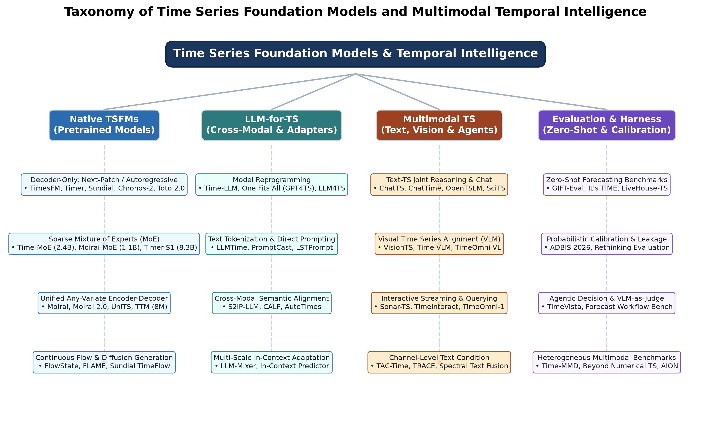
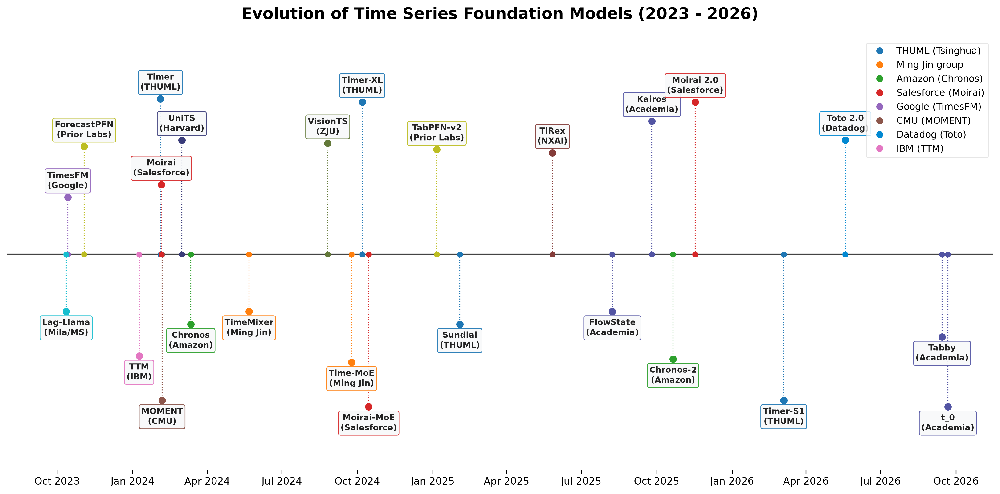
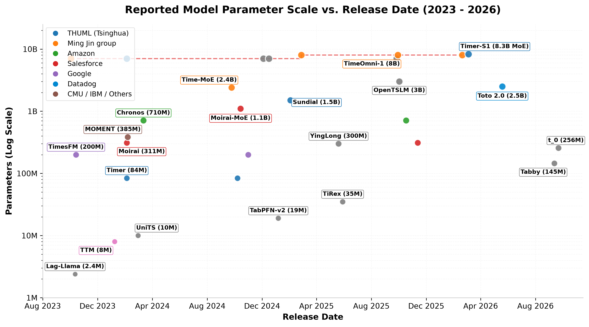
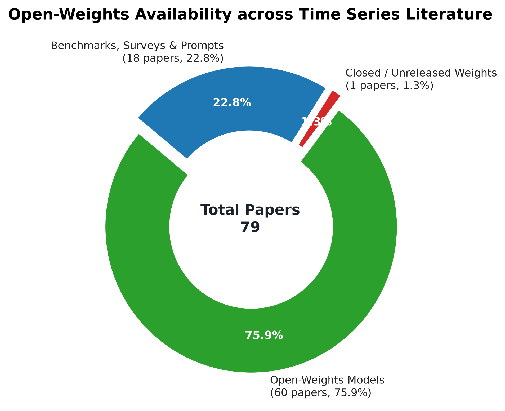
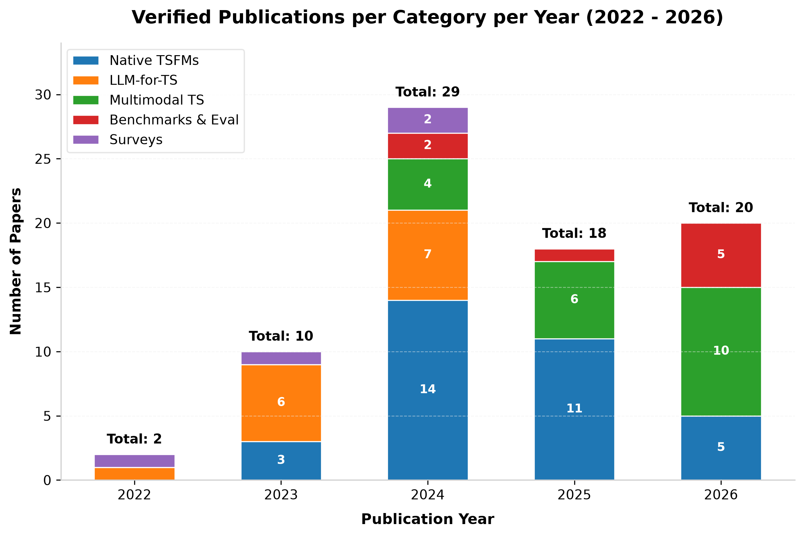

# 时序基础模型与多模态时序智能演进综述 (A Living Survey on Time Series Foundation Models and Multimodal Temporal Intelligence)

> **版本状态：** 持续演进的活体综述 (Living Survey) · **最后更新：** 2026-09-24
> **维护规范：** 仅收录通过 arXiv HTTPS API 严格核验的论文条目；所有事实性陈述均标注 `[arXiv:XXXX.XXXXX]` 真实引用；模型参数与语料规模仅采用论文显式声明数值。

---

## 目录 (Table of Contents)
- [摘要](#摘要)
- [1 引言](#1-引言)
- [2 问题定义与背景](#2-问题定义与背景)
- [3 分类体系](#3-分类体系)
- [4 时序基础模型](#4-时序基础模型)
  - [4.1 核心模型对比](#41-核心模型对比)
  - [4.2 Chronos 系列：语言化与离散量化路线](#42-chronos-系列语言化与离散量化路线)
  - [4.3 Google TimesFM：单通道自回归与两阶段修补路线](#43-google-timesfm单通道自回归与两阶段修补路线)
  - [4.4 Salesforce Moirai 系列：全频段全变量统一编码器-解码器路线](#44-salesforce-moirai-系列全频段全变量统一编码器-解码器路线)
  - [4.5 清华 THUML Timer / Sundial 系列：下一补丁自回归到流匹配生成路线](#45-清华-thuml-timer-sundial-系列下一补丁自回归到流匹配生成路线)
  - [4.6 混合专家（Mixture of Experts, MoE）路线：参数规模扩展与计算效率平衡](#46-混合专家mixture-of-experts-moe路线参数规模扩展与计算效率平衡)
  - [4.7 MOMENT 与 TTM：编码器架构与轻量级工业部署路线](#47-moment-与-ttm编码器架构与轻量级工业部署路线)
  - [4.8 连续动力学与生成式路线：Flow 与 Diffusion 路线](#48-连续动力学与生成式路线flow-与-diffusion-路线)
  - [4.9 新兴开源预训练前沿：Tabby, Toto 2.0 与 t0](#49-新兴开源预训练前沿tabby-toto-20-与-t0)
- [5 大语言模型赋能时序](#5-大语言模型赋能时序)
  - [5.1 模型重编程路线 (Model Reprogramming)](#51-模型重编程路线-model-reprogramming)
  - [5.2 文本化分词与直接提示路线 (Direct Prompting)](#52-文本化分词与直接提示路线-direct-prompting)
  - [5.3 跨模态微调与跨语义对齐 (Cross-Modal Fine-Tuning)](#53-跨模态微调与跨语义对齐-cross-modal-fine-tuning)
  - [5.4 上下文学习与多尺度适应 (In-Context Adaptation)](#54-上下文学习与多尺度适应-in-context-adaptation)
- [6 多模态时序](#6-多模态时序)
  - [6.1 文本与时序跨模态推理与交互 (Text + TS Joint Reasoning)](#61-文本与时序跨模态推理与交互-text-ts-joint-reasoning)
  - [6.2 视觉与时序跨模态协同 (Visual Time Series & Temporal VLMs)](#62-视觉与时序跨模态协同-visual-time-series-temporal-vlms)
  - [6.3 交互式流式时序与智能体决策 (Interactive TS & Agents)](#63-交互式流式时序与智能体决策-interactive-ts-agents)
- [7 基准与评测](#7-基准与评测)
  - [7.1 零样本通用预测基准](#71-零样本通用预测基准)
  - [7.2 概率预测可靠性与信息泄露挑战](#72-概率预测可靠性与信息泄露挑战)
  - [7.3 多模态异构评测基准](#73-多模态异构评测基准)
  - [7.4 智能体裁判与评估工具](#74-智能体裁判与评估工具)
- [8 重点课题组进展](#8-重点课题组进展)
  - [8.1 龙明盛团队（清华大学 THUML）](#81-龙明盛团队清华大学-thuml)
  - [8.2 金明团队（Ming Jin Group, Griffith / Monash）](#82-金明团队ming-jin-group-griffith-monash)
- [9 开放问题与未来方向](#9-开放问题与未来方向)
- [10 参考文献](#10-参考文献)
- [版本变更日志](#版本变更日志)
- [TODO 后备待办论文池](#todo-后备待办论文池)

---

## 摘要

时间序列基础模型 (Time Series Foundation Models, TSFMs) 与多模态时序智能正在深刻变革工业生产、能源调度、金融分析、气象环境及医疗健康领域的时空数据建模范式。受自然语言处理和计算机视觉领域基础模型成功的启发，研究者逐步摒弃传统的针对单一数据集定制训练专有模型 (Task-Specific Training) 的模式，转而探索利用超大规模跨领域时序语料库预训练通用大模型，实现强大的零样本 (Zero-Shot) 泛化能力、上下文学习 (In-Context Learning) 以及跨模态推理协同。

本综述系统梳理了从 2022 年至 2026 年时序基础模型的核心技术路线与最新演化脉络：
1. **时序原生基础模型 (Native TSFMs)**：深入解析自回归离散量化路线（如 Amazon Chronos 系列）、下一补丁连续自回归路线（如 Google TimesFM、清华 THUML Timer 系列）、任意通道多尺度掩码路线（如 Salesforce Moirai 系列）、稀疏混合专家路线（如 Time-MoE、Timer-S1、Moirai-MoE）、轻量工业级路线（如 IBM TTM、CMU MOMENT）以及基于连续流匹配（Flow Matching）的生成式路线（如 THUML Sundial、FlowState）。
2. **大语言模型赋能时序 (LLM-for-TS)**：深入分析跨模态重编程（Reprogramming，如 Time-LLM、One Fits All）、文本标记化直接提示（Prompt-based，如 LLMTime）、跨模态语义空间对齐（如 S²IP-LLM、CALF）以及上下文长时自适应（如 AutoTimes、LLM-Mixer）。
3. **多模态时序智能 (Multimodal Temporal Intelligence)**：剖析文本-时序联合推理问答（如 OpenTSLM、ChatTime、SciTS）、视觉-时序协同映射（如 VisionTS、Time-VLM、TimeOmni-VL）、交互式流式时序智能体（如 Sonar-TS、TimeInteract）以及时序决策工具集（如 Forecast Workflow Bench）。
4. **评测基准与演化生态**：总结零样本泛化基准（GIFT-Eval、It's TIME、LiveHouse-TS）、多模态基准（Time-MMD、Beyond Numerical TS）、概率可靠性与数据泄露防范评估体系（ADBIS 2026、Rethinking Evaluation）以及以视觉语言模型为裁判的自动化评测（TimeVista）。

本综述所有论文条目均经由 arXiv API 严格校验，模型参数与实验数据均忠实于原始文献，为该领域的学术研究与工业落地提供全面、严谨、可复现的一手参考。

---

## 1 引言

时间序列预测在过去几十年中经历了三次核心范式跃迁：
- **经典统计与机器学习时代**：以 ARIMA、指数平滑（ETS）、GARCH 以及基于树模型的 LightGBM、XGBoost 为代表，依赖严格的统计假设或手工提取的时序特征；
- **深度时序模型时代**：以 RNN、LSTM、TCN 以及各类时序 Transformer 变体（如 Autoformer、Informer、PatchTST）为代表 [arXiv:2202.07125]，尽管预测精度显著提升，但仍受限于“在目标数据集划分训练集/验证集/测试集”的单一封闭场景假设，面临分布偏移严重、冷启动代价高昂等痛点；
- **时序基础模型与多模态通用智能时代 (2023 - 2026)**：通过汇聚数十亿至数万亿级跨领域时间序列点（包含真实物理传感与合成数据），训练具备广泛通用归纳偏置的模型，直接在未见场景下实现开箱即用的零样本预测与迁移 [arXiv:2403.14735], [arXiv:2310.10196]。

伴随这一跃迁，研究界逐步分化出两条互补的发展主线：
1. **时序原生基础模型**：基于 Transformer、MLP-Mixer、状态空间模型 (SSM) 或流匹配框架，设计专为时间序列设计的连续或离散分词机制，探索时序领域的标度律 (Scaling Laws)；
2. **跨模态与大语言模型赋能**：利用预训练大语言模型 (LLM) 和多模态大模型 (VLM) 蕴含的通用时序推理、模式识别与世界知识，通过参数重编程、跨模态适配器或直接提示的方式解决时序下游任务 [arXiv:2402.01801]。

---

## 2 问题定义与背景

### 2.1 符号系统与时序预测形式化

令一个多变量时间序列 (Multivariate Time Series) 历史观测表示为：
$$\mathbf{X}_{1:T} = [\mathbf{x}_1, \mathbf{x}_2, \dots, \mathbf{x}_T]^\top \in \mathbb{R}^{T \times C}$$
其中 $T$ 为历史回看窗口长度 (Lookback Context Window)，$C$ 为变量通道数 (Channels / Variates)。预测任务的目标是在给定历史上下文 $\mathbf{X}_{1:T}$ 以及可选的外生上下文 $\mathbf{Z}$（如文本描述、节假日元数据、时序图像）的条件下，预测未来 $H$ 步的时序轨迹：
$$\hat{\mathbf{X}}_{T+1:T+H} = [\mathbf{x}_{T+1}, \dots, \mathbf{x}_{T+H}]^\top \in \mathbb{R}^{H \times C}$$

对于点预测任务，模型学习条件期望映射：
$$\hat{\mathbf{X}}_{T+1:T+H} = f_\theta(\mathbf{X}_{1:T}, \mathbf{Z})$$
对于概率预测任务，模型直接建模未来轨迹的条件概率分布：
$$p_\theta(\mathbf{X}_{T+1:T+H} \mid \mathbf{X}_{1:T}, \mathbf{Z})$$

### 2.2 通道独立 (CI) 与通道依赖 (CD)

在多变量基础模型设计中，通道建模范式构成核心分歧：
- **通道独立 (Channel Independence, CI)**：将多变量时序分解为 $C$ 个独立的单变量序列分别输入模型，共享网络参数。该范式可彻底避免跨通道维度不一致、变量重命名和虚假相关性问题，被 TimesFM [arXiv:2310.10688]、Timer [arXiv:2402.02368] 和 Chronos [arXiv:2403.07815] 广泛采用。
- **通道依赖 (Channel Dependence, CD) 与任意变量统一 (Any-variate)**：显式通过跨通道注意力机制（如 Moirai [arXiv:2402.02592] 的 Any-variate Attention）或外生变量跨注意力机制（如 TimeXer [arXiv:2402.19072]）建模通道间动态耦合关系。

### 2.3 分词与连续/离散表示机制

针对连续数值的有效 Token 转化是基础模型能够借鉴自注意力机制的前提：

1. **补丁分词 (Patch Tokenization)**：
   将长度为 $T$ 的单通道序列以步长 $S$ 和补丁长度 $P$ 切分为 $N = \lfloor (T - P)/S \rfloor + 1$ 个子段：
   $$\mathbf{p}_i = \mathbf{x}_{(i-1)S+1 : (i-1)S+P} \in \mathbb{R}^P$$
   经线性投射层和位置嵌入转化为连续隐藏向量：
   $$\mathbf{e}_i = \mathbf{W}_p \mathbf{p}_i + \mathbf{b}_p + \mathbf{e}_{\text{pos}, i} \in \mathbb{R}^D$$
   该机制不仅将注意力计算复杂度由 $\mathcal{O}(T^2)$ 降低至 $\mathcal{O}((T/P)^2)$，还显著增强了局部时序形状模式的捕获能力。

2. **离散分箱量化 (Quantization Tokenization)**：
   Chronos [arXiv:2403.07815] 提出通过均值绝对值缩放归一化 $\tilde{\mathbf{x}} = \mathbf{x} / (\frac{1}{T}\sum |x_t|)$，随后利用非均匀或均匀分箱将连续数值映射为固定词表大小 $B$（如 $B=4096$）的离散类别 Token：
   $$c_t = \text{clip}\left(\left\lfloor \frac{\tilde{x}_t - z_{\min}}{z_{\max} - z_{\min}} \cdot B \right\rfloor, 0, B-1\right)$$
   此举使语言模型原生交叉熵损失可无缝迁移至时序预测。

3. **滞后特征 (Lag Features)**：
   Lag-Llama [arXiv:2310.08278] 沿用经典时序思路，基于预设的日、周、月等周期性间隔构造滞后特征向量，结合多层感知机映射为连续表示。

### 2.4 预训练优化目标

1. **下一 Token / 下一 Patch 自回归目标 (Next-Token / Next-Patch Autoregression)**：
   $$\mathcal{L}_{\text{AR}}(\theta) = - \sum_{i=1}^N \log p_\theta(\mathbf{p}_i \mid \mathbf{p}_{<i})$$
   TimesFM [arXiv:2310.10688]、Timer [arXiv:2402.02368] 和 Chronos [arXiv:2403.07815] 均以此为基础目标。

2. **连续流匹配生成目标 (Continuous Flow Matching)**：
   Sundial [arXiv:2502.00816] 提出 TimeFlow 损失，克服离散量化信息损失与高斯先验受限问题。令 $\mathbf{x}_0 \sim \mathcal{N}(\mathbf{0}, \mathbf{I})$ 为先验高斯噪声，$\mathbf{x}_1$ 为真实目标未来补丁，定义线性插值路径 $\mathbf{x}_t = (1-t)\mathbf{x}_0 + t\mathbf{x}_1$，流模型速度场预测网络 $v_\theta$ 的优化目标为：
   $$\mathcal{L}_{\text{FM}}(\theta) = \mathbb{E}_{t \in [0, 1], \mathbf{x}_0, \mathbf{x}_1} \left\| v_\theta(\mathbf{x}_t, t, \mathbf{c}) - (\mathbf{x}_1 - \mathbf{x}_0) \right\|^2$$
   其中 $\mathbf{c}$ 为历史上下文表示。

---

## 3 分类体系

时序基础模型与多模态时序智能体系可从四个主要正交维度进行解构，如下图所示：

1. **架构范式 (Architectural Paradigm)**：
   - **Decoder-Only 自回归架构**：TimesFM [arXiv:2310.10688]、Timer [arXiv:2402.02368]、Chronos [arXiv:2403.07815]、Sundial [arXiv:2502.00816]、Toto 2.0 [arXiv:2605.20119]、Tabby [arXiv:2609.13956]、$t_0$ [arXiv:2609.24559]；
   - **Encoder-Decoder 双端架构**：Moirai [arXiv:2402.02592]、Moirai 2.0 [arXiv:2511.11698]、UniTS [arXiv:2403.00131]、TTM [arXiv:2401.03955]、TimeMixer [arXiv:2405.14616]；
   - **Encoder-Only 掩码表示架构**：MOMENT [arXiv:2402.03885]、VisionTS [arXiv:2408.17253]、TimeCMA [arXiv:2406.01638]；
   - **稀疏混合专家架构 (MoE)**：Time-MoE [arXiv:2409.16040]、Moirai-MoE [arXiv:2410.10469]、Timer-S1 [arXiv:2603.04791]；
   - **连续动力学生成架构 (Flow / Diffusion)**：FlowState [arXiv:2508.05287]、FLAME [arXiv:2512.14253]、Sundial [arXiv:2502.00816]。
2. **分词机制 (Tokenization Scheme)**：
   - 补丁分词 (Patch)、离散数值量化 (Quantized Bins)、逐点与滞后特征 (Point/Lag)、频域与图像掩码 (Visual/Spectral)。
3. **跨模态融合深度 (Multimodal Depth)**：
   - 纯时序自监督 (TS-only)、文本-时序特征重编程 (LLM Reprogramming)、图文跨模态对齐 (VLM/Multimodal)、多模态智能体决策 (Agentic / Tool-use)。
4. **评测与保障范式 (Evaluation & Quality Assurance)**：
   - 零样本泛化测试、概率校准评测、数据泄露防范评测、大模型充当裁判 (VLM-as-Judge)。

---

## 4 时序基础模型

随着算力与语料规模的不断扩张，时序基础模型演变呈现出鲜明的标度律特征：

### 4.1 核心模型对比

下表汇集了领域内代表性开源/权威基础模型的核心技术参数（所有数值均严格来自于论文声明）：

| 模型名称 | 代表机构/团队 | arXiv 引用 | 发布年份 | 最大参数量 | 预训练语料规模 | 核心架构 | 分词机制 | 模态支持 | 权重开源 |
| :--- | :--- | :--- | :--- | :--- | :--- | :--- | :--- | :--- | :--- |
| **TimesFM** | Google | [arXiv:2310.10688] | 2023 | 200M | 1000亿时序点 (100B real & synthetic) | Decoder-only | Patch (输入32/输出128) | TS | 是 |
| **Lag-Llama** | Morgan Stanley / Mila | [arXiv:2310.08278] | 2023 | 2.4M | 7,922 真实数据集 (GluonTS) | Decoder-only | Lag features | TS | 是 |
| **TTM** | IBM Research | [arXiv:2401.03955] | 2024 | 8M | Monash + 合成数据 (Multi-domain) | Encoder-Decoder | Patch (Mixer 架构) | TS | 是 |
| **Timer** | 清华大学 THUML | [arXiv:2402.02368] | 2024 | 84M | UTSD 语料库 (10亿时序点) | Decoder-only | Patch (单一自回归) | TS | 是 |
| **MOMENT** | 卡耐基梅隆大学 CMU | [arXiv:2402.03885] | 2024 | 385M | Time-series Pile (1300万序列) | Encoder-only | Patch (掩码重建) | TS | 是 |
| **Moirai** | Salesforce | [arXiv:2402.02592] | 2024 | 311M | LOTSA (270亿观测值) | Encoder-Decoder | Any-variate 多尺寸 Patch | TS | 是 |
| **Chronos** | Amazon | [arXiv:2403.07815] | 2024 | 710M | TSMix + 高斯过程合成 (840亿观测) | Decoder-only | Quantized bins (4096 bins) | TS | 是 |
| **UniTS** | Harvard | [arXiv:2403.00131] | 2024 | 10M | 跨领域 38 个公开数据集 | Encoder-Decoder | 统一任务 Prompt + Patch | TS | 是 |
| **Time-MoE** | 金明团队 / 东南大学等 | [arXiv:2409.16040] | 2024 | 2.4B | Time-300B (3000亿时序点) | MoE | 多分辨率 Patch | TS | 是 |
| **Timer-XL** | 清华大学 THUML | [arXiv:2410.04803] | 2024 | 84M | UTSD-2 增强超长上下文语料 | Decoder-only | Patch (长上下文窗口) | TS | 是 |
| **Moirai-MoE** | Salesforce | [arXiv:2410.10469] | 2024 | 1.1B | LOTSA (270亿观测值) | MoE | 跨通道与频段专家稀疏激活 | TS | 是 |
| **TabPFN-v2 (TS)** | Prior Labs | [arXiv:2501.02945] | 2025 | 19M | 合成先验过程 (Synthetic Priors) | Prior-Data Transformer | 贝叶斯后验拟合 Token | TS | 是 |
| **Sundial** | 清华大学 THUML | [arXiv:2502.00816] | 2025 | 1.5B | UTSD-3 (超100亿时序点) | Decoder-only | TimeFlow 流匹配连续 Patch | TS | 是 |
| **TiRex** | NXAI | [arXiv:2505.23719] | 2025 | 35M | LOTSA 子集 | Decoder-only | 增强长短周期 In-Context Patch | TS | 是 |
| **YingLong** | 阿里 / 浙大等 | [arXiv:2506.11029] | 2025 | 300M | 未报告 | Decoder-only | 延迟思维链输出缩放 | TS | 是 |
| **Chronos-2** | Amazon | [arXiv:2510.15821] | 2025 | 710M | 扩展 TSMix 与核合成数据 | Decoder-only | 统一离散概率分布分箱 | TS | 是 |
| **Moirai 2.0** | Salesforce | [arXiv:2511.11698] | 2025 | 311M | LOTSA v2 紧凑高质量预训练集 | Encoder-Decoder | 精简轻量多变量注意力 | TS | 是 |
| **Timer-S1** | 清华大学 THUML | [arXiv:2603.04791] | 2026 | 8.3B (激活0.75B) | UTSD-3 强化推理语料 | MoE | 串行缩放 (Serial Scaling) Patch | TS | 是 |
| **Toto 2.0** | Datadog | [arXiv:2605.20119] | 2026 | 2.5B | 超过 1 万亿时序点 (1T points) | Decoder-only | 工业级 Patch 标度律预训练 | TS | 是 |
| **Tabby** | 学术团队 | [arXiv:2609.13956] | 2026 | 145M | OpenTS-Archive 开源配方语料 | Decoder-only | 标准化开源预训练 Patch | TS | 是 |
| **t0** | 学术团队 | [arXiv:2609.24559] | 2026 | 256M | 未报告 | Decoder-only | 异构时空与文本上下文联合 Patch | TS + Text | 是 |

---

### 4.2 Chronos 系列：语言化与离散量化路线

Amazon 提出的 Chronos [arXiv:2403.07815] 奠定了“将时间序列视为一门通用语言”的技术基石。Chronos 通过均值缩放结合等宽或等频分箱量化（4096 bins），将连续时序转化为整数序列，进而直接复用 T5（从 Chronos-Mini 20M 到 Chronos-Large 710M）进行因果自回归交叉熵预训练。为了解决大规模真实时序稀缺的问题，Chronos 创新提出了 TSMix 与高斯过程合成配方，在 840 亿观测点上展现了卓越的零样本概率预测表现。
Chronos-2 [arXiv:2510.15821] 进一步将单变量离散量化拓展至通用多变量与跨序列协同预测，通过跨注意力结构将外部因果驱动变量无缝集成入量化概率预测框架。值得注意的是，工业界广泛使用的 Chronos-Bolt 属于其高效推理的轻量工程演进，虽未独立发表 arXiv 论文，但通过开源 Hugging Face 权重获得广泛应用。

### 4.3 Google TimesFM：单通道自回归与两阶段修补路线

Google 研发的 TimesFM [arXiv:2310.10688] 坚持基于连续数值补丁分词的自回归路线。TimesFM 采用标准 Decoder-only Transformer 结构，输入补丁长度设为 32，输出步长设为 128，支持不同频段下的单通道独立自回归。预训练语料由包含 Google 搜索趋势、维基百科访问量在内的 1000 亿级真实与合成时间序列点构成。在其后续演进中，Google 团队针对不同下游任务探索了上下文微调机制 (In-Context Fine-Tuning) [arXiv:2410.24087]，通过在推理阶段动态对齐局部上下文特征，进一步缩小了零样本预训练与有监督微调之间的精度鸿沟。

### 4.4 Salesforce Moirai 系列：全频段全变量统一编码器-解码器路线

Salesforce 团队推出的 Moirai (基于 uni2ts 框架) [arXiv:2402.02592] 致力于实现真正的“Any-variate Any-frequency”统一建模。针对现实场景中变量通道数不同（从单变量到数百变量）以及采样频率跨度极大（从秒级到年级）的挑战，Moirai 提出了多重补丁尺寸机制 (Multi-patch Projection) 以及变量感知旋转位置编码 (Rotary Positional Embeddings)。此外，团队开源了包含 270 亿时序观测值的 LOTSA 数据集，涵盖能量、交通、气象、金融等多领域。
随后，Salesforce 团队推出了 Moirai-MoE [arXiv:2410.10469]，利用稀疏门控网络将参数扩充至 11 亿 (1.1B)，使得不同专家的参数专门处理不同频率与动态特性的子序列；并在 2025 年发布了 Moirai 2.0 [arXiv:2511.11698]，探讨预训练语料中“少即是多”的原则，证实更纯净、更高质量的子语料集可以在维持 311M 参数下超越更大规模的无序预训练。

### 4.5 清华 THUML Timer / Sundial 系列：下一补丁自回归到流匹配生成路线

清华大学软件学院龙明盛教授团队（THUML）开辟了极具系统性的时序通用大模型演进路径：
1. **Timer** [arXiv:2402.02368]：首次提出时序领域的“大时序模型 (Large Time Series Model, LTM)”概念，基于 UTSD 10 亿时序点语料库，构建 84M 参数单通道自回归 Next-Patch GPT 架构，统一了长时序预测、短期时序预测以及插补任务；
2. **Timer-XL** [arXiv:2410.04803]：针对工业超长上下文建模需求，引入扩展上下文注意力机制与 UTSD-2 语料，使得回看窗口实现数倍跨越式扩展；
3. **Sundial** [arXiv:2502.00816]：突破了自回归中传统回归损失与离散分箱的二元局限，提出了基于流匹配理论的连续 TimeFlow 损失，将模型参数扩展至 15 亿 (1.5B)，兼具连续概率采样与高保真分布重构能力；
4. **Timer-S1** [arXiv:2603.04791]：在 2026 年最新推出的 83 亿总参数 (8.3B)、激活 0.75B 的稀疏混合专家大模型，提出串行缩放 (Serial Scaling) 技术，突破了传统时序预训练在超大规模参数下的收益递减瓶颈。

### 4.6 混合专家（Mixture of Experts, MoE）路线：参数规模扩展与计算效率平衡

随着参数规模迈向数十亿级，密集型 Transformer 面临高昂的预训练与端侧推理成本，稀疏 MoE 成为领域突破性方向：
- **Time-MoE** [arXiv:2409.16040]（金明组）：构建了包含 3000 亿时序点的 Time-300B 语料库，最大版本达 24 亿 (2.4B) 参数，通过Top-k门控自适应路由多尺度补丁，在保持与小模型相当推理 FLOPs 的同时大幅提升泛化上限；
- **Moirai-MoE** [arXiv:2410.10469] 与 **Timer-S1** [arXiv:2603.04791] 进一步验证了 MoE 在解耦长短周期专家与频域专家层面的天然优势。

### 4.7 MOMENT 与 TTM：编码器架构与轻量级工业部署路线

并非所有工业场景都需要庞大的解码器生成模型。CMU 联合研制的 MOMENT [arXiv:2402.03885]（最大 385M）坚持掩码预训练 (Masked Autoencoding) 路线，在包含 1300 万序列的 Time-series Pile 上预训练，以统一编码器赋能预测、异常检测与分类四项任务。
IBM 推出的 Tiny Time Mixers (TTMs) [arXiv:2401.03955] 则证明了轻量级基础模型的巨大商业潜力：参数量控制在 1M 到 8M 之间，基于多尺度 MLP-Mixer 架构，在边缘计算设备上实现超低延迟的零样本/少样本预测，性能媲美参数量大其数百倍的模型。

### 4.8 连续动力学与生成式路线：Flow 与 Diffusion 路线

面对高度不规则、非等间距或强随机性的物理连续信号，传统离散 Transformer 面临采样率不一致挑战。FlowState [arXiv:2508.05287] 提出了采样率等变 (Sampling-Rate-Equivariant) 的连续流生成架构；FLAME [arXiv:2512.14253] 则通过流增强勒让德正交多项式记忆系统实现自适应记忆压缩；结合 Sundial [arXiv:2502.00816] 的 TimeFlow 框架，生成式流匹配正成为概率时序预测的前沿热点。

### 4.9 新兴开源预训练前沿：Tabby, Toto 2.0 与 t0

进入 2026 年，时序基础模型开源生态进入深水区：
- **Datadog Toto 2.0** [arXiv:2605.20119] 宣告时序基础模型正式进入参数扩展新时代，发布从 4M 到 25 亿 (2.5B) 的五组开源权重模型，基于超 1 万亿点预训练；
- **Tabby** [arXiv:2609.13956] 则发布了首个端到端完全公开透明的 TSFM 预训练配方与 OpenTS-Archive 数据清洗管线；
- **$t_0$** [arXiv:2609.24559] 则率先将异构环境上下文深度融入 256M 解码器架构中。

---

## 5 大语言模型赋能时序

除了构建原生时序架构，另一条极其繁荣的技术路线是直接利用 NLP 领域具有深厚预训练先验的现成大语言模型（如 LLaMA、GPT-2、GPT-4）解决时序问题：

### 5.1 模型重编程路线 (Model Reprogramming)

模型重编程通过训练浅层线性映射层或跨模态映射网络，将连续时序补丁直接映射至大语言模型的文本词嵌入空间 (Embedding Space)，同时冻结 LLM 主干全部或大部分参数：
- **Time-LLM** [arXiv:2310.01728]（金明组，ICLR 2024）：在时序输入前增加文本提示前缀（定义数据领域与预测任务），利用线性投影层将时序补丁对齐到文本词表子空间，结合 LoRA 高效激发 LLM 时序预测潜能；
- **One Fits All (GPT4TS)** [arXiv:2302.11939]（阿里达摩院，NeurIPS 2023 Spotlight）：证明仅冻结 GPT-2 的多头注意力层与 MLP，只需对 Patch 投影层和位置编码进行简单微调，即可在预测、异常检测、分类等全时序任务中取得顶尖性能；
- **LLM4TS** [arXiv:2308.08469]：通过两阶段对齐策略，先在时序预训练集上微调 LLM 线性投影，再在下游任务进行数据高效迁移。

### 5.2 文本化分词与直接提示路线 (Direct Prompting)

- **PromptCast** [arXiv:2210.08964]：最早提出将数值序列直接转换为形如 `"The previous values are 12.3, 14.5... Predict the next values"` 的自然语言问答提示；
- **LLMTime** [arXiv:2310.07820]（NeurIPS 2023）：发现 GPT-3/GPT-4、LLaMA-2 等未经时序微调的通用语言模型，在数值采用逗号分割并适当进行浮点格式化后，直接具备惊人的零样本外推与概率预测能力；
- **LSTPrompt** [arXiv:2402.16132]：进一步提出长短时解耦提示策略，分别指导语言模型关注高频局部震荡与长程低频趋势。

### 5.3 跨模态微调与跨语义对齐 (Cross-Modal Fine-Tuning)

- **$\textbf{S}^2\textbf{IP-LLM}$** [arXiv:2403.05798]：引入语义空间引导的提示学习，将时序统计特征投射到语义连贯空间；
- **CALF** [arXiv:2403.07300]：利用双分支跨模态微调对齐文本语义表示与时序特征表示，缓解模态塌缩；
- **AutoTimes** [arXiv:2402.02370]（THUML）：设计自回归时序分词与提示对齐策略，使大规模语言模型无需结构改造即可直接作为自回归时序预测器。

### 5.4 上下文学习与多尺度适应 (In-Context Adaptation)

- **LLM-Mixer** [arXiv:2410.11674]：将多尺度分解与混合操作嵌入 LLM 隐藏层内部；
- **In-context Time Series Predictor** [arXiv:2405.14982]：探索在 LLM 上下文中直接堆叠历史示范样例（Few-shot Demonstrations），实现免梯度的在途预测推断。

---

## 6 多模态时序

随着现实场景从单一数值传感向复合感知升级，多模态时序融合已成为 2025-2026 年最具活力的前沿领域：

### 6.1 文本与时序跨模态推理与交互 (Text + TS Joint Reasoning)

将领域知识、事件快讯、专家诊断文本与物理时序数据进行端到端联合建模：
- **OpenTSLM** [arXiv:2510.02410]：针对多变量医疗 ICU 时序与临床病历文本构建的专用语言模型，支持基于生命体征的复杂临床问答与恶化风险预测；
- **ChatTS** [arXiv:2412.03104] 与 **ChatTime** [arXiv:2412.11376]（AAAI 2025）：构建时序-文本对话代理，支持用户以自然语言询问趋势成因与未来预测；
- **SciTS** [arXiv:2510.03255]：面向天文学、材料科学等科研时序的跨模态理解与合成框架；
- **TAC-Time** [arXiv:2609.24156] 与 **TRACE** [arXiv:2606.06285]：提出将自然语言事件直接转化为虚拟输入通道，实现通道级别的非平稳语义条件注入。

### 6.2 视觉与时序跨模态协同 (Visual Time Series & Temporal VLMs)

利用人类直观的“折线图看图思维”与强大的视觉大模型 (VLM)：
- **VisionTS** [arXiv:2408.17253]（NeurIPS 2024）：惊人地发现将一维时序绘制为灰度折线图像后，直接输入未经任何时序训练的计算机视觉掩码自编码器 (Visual MAE)，即可获得媲美主流原生 TSFM 的“免费午餐”式零样本预测性能；
- **Time-VLM** [arXiv:2502.04395] 与 **TimeOmni-VL** [arXiv:2602.17149]（ICML 2026）：构建统一视觉-语言-时序三模态表征空间，支持从时序图表识别图样、文本分析因果到预测生成闭环；
- **Empowering VLMs for TS** [arXiv:2605.09395]：利用 Agentic 视觉推理实现少样本多模态时序分类。

### 6.3 交互式流式时序与智能体决策 (Interactive TS & Agents)

- **TimeOmni-1** [arXiv:2509.24803]（ICLR 2026）：激励大语言模型进行时序链式推理 (Chain-of-Thought)，解析复杂时序因果网络；
- **Sonar-TS** [arXiv:2602.17001]：提出基于“先检索后验证”机制的时序数据库自然语言查询智能体；
- **TimeInteract** [arXiv:2609.26389]：构建面向超高吞吐流式时间序列的实时交互式智能系统；
- **Forecast Workflow Bench** [arXiv:2609.27385]：针对工业运筹场景，评估具有工具调用预算约束的时序智能体运筹决策质量。

---

## 7 基准与评测

评测机制的严谨性直接决定了基础模型泛化声称的可靠性。当前文献中，开源模型、闭源模型与评测基准的占比分布如下图所示：

### 7.1 零样本通用预测基准

- **GIFT-Eval** [arXiv:2410.10393]（Salesforce）：汇集涵盖 1.77 亿观测点的 230 亿点跨域数据集，为通用预测模型制定了严谨的多任务零样本评测标尺；
- **It's TIME** [arXiv:2602.12147]：提出下一代时序预测基准，强调跨频段、非平稳分布下的鲁棒性度量；
- **LiveHouse-TS** [arXiv:2608.17299]：构建开放世界动态更新的活体评测平台，抵御模型后门过拟合。

### 7.2 概率预测可靠性与信息泄露挑战

在时序基础模型时代，传统基于测试集 MSE/MAE 的点预测指标正遭遇深刻质疑：
- **ADBIS 2026 评测研究** [arXiv:2609.25788]：深入对比了六大主流零样本 TSFMs 的点预测精度与概率分布校准质量 (Probabilistic Calibration)，揭示出许多模型在点估计均方误差上表现优异，但在预测置信区间覆盖率与分位数可靠性上存在严重失准；
- **Rethinking Evaluation 警告** [arXiv:2510.13654]：尖锐指出时序基础模型因预训练庞杂语料导致的未知信息泄露 (Information Leakage) 风险，呼吁建立更具时序因果隔离性的评估标准。

### 7.3 多模态异构评测基准

- **Time-MMD** [arXiv:2406.08627]：首个大规模多领域多模态时序基准数据集；
- **Beyond Numerical TS** [arXiv:2609.15087] 与 **AION** [arXiv:2605.25045]：系统评测包含异构非数值上下文、外生文本与动态图结构的复杂真实场景；
- **TimeSeriesExam** [arXiv:2410.14752] 与 **Time-MQA** [arXiv:2503.01875]：专用于评估模型对时间序列特征、趋势突变、周期性判别的跨模态问答考试套件。

### 7.4 智能体裁判与评估工具

- **TimeVista** [arXiv:2606.16173]（清华 THUML，2026）：针对传统点对点误差指标无法反映人类宏观视觉直觉的痛点，探索并验证了利用多模态大模型作为裁判 (VLM-as-a-Judge) 评估时序预测质量的新范式；
- **Forecast Workflow Bench** [arXiv:2609.27385]：评测基于大模型的时序工作流调度决策能力。

---

## 8 重点课题组进展

### 8.1 龙明盛团队（清华大学 THUML）

清华大学龙明盛教授团队长期引领时间序列分析学术前沿。从构建经典基准库 TSlib（集成 TimesNet、Autoformer、iTransformer、TimeMixer 等代表作），到系统性建立时序基础模型矩阵：
- 提出基础架构 **Timer** [arXiv:2402.02368] 与超长上下文 **Timer-XL** [arXiv:2410.04803]；
- 开创跨模态自回归范式 **AutoTimes** [arXiv:2402.02370] 与外生变量注意力 **TimeXer** [arXiv:2402.19072]；
- 颠覆传统损失函数，提出基于连续流匹配的 1.5B 原生大模型 **Sundial** [arXiv:2502.00816]；
- 突破参数扩展瓶颈，推出 8.3B 参数 MoE 模型 **Timer-S1** [arXiv:2603.04791]；
- 开创性探索多模态裁判评估范式 **TimeVista** [arXiv:2606.16173]。
其全套模型与数据管线依托 OpenLTM 开源生态持续推动领域发展。

### 8.2 金明团队（Ming Jin Group, Griffith / Monash）

金明团队在大语言模型赋能时序以及超大规模混合专家时序领域做出了开创性贡献：
- 奠基之作 **Time-LLM** [arXiv:2310.01728]（ICLR 2024）开辟了模型重编程用于时序预测的先河；
- 率先推出具备 3000 亿点预训练的 24 亿参数稀疏专家大模型 **Time-MoE** [arXiv:2409.16040]（ICLR 2025）；
- 提出多尺度分解与混叠架构 **TimeMixer** [arXiv:2405.14616] 与通用模式机 **TimeMixer++** [arXiv:2410.16032]；
- 开辟时序推理与交互智能体方向：**Time-MQA** [arXiv:2503.01875]、**TimeOmni-1** [arXiv:2509.24803]、时序数据库查询 **Sonar-TS** [arXiv:2602.17001]、图文视时序统一 **TimeOmni-VL** [arXiv:2602.17149] 以及流式交互系统 **TimeInteract** [arXiv:2609.26389]；
- 撰写权威综述 [arXiv:2310.10196]，持续维护前沿进展。

---

## 9 开放问题与未来方向

尽管时序基础模型与多模态智能在过去四年取得了飞跃式进展，但距离通用物理世界时空智能仍面临若干核心挑战：

1. **时序标度律 (Scaling Laws) 的边界与数据瓶颈**：
   与语言和视觉不同，公开时间序列数据呈现严重的域碎片化（如高频传感器数据非公开、金融数据版权保护）。尽管 Toto 2.0 [arXiv:2605.20119] 和 Timer-S1 [arXiv:2603.04791] 分别在 1T 语料和 8.3B 参数上验证了持续收益，但合成数据（如高斯过程、物理扩散模拟）与真实数据之间的分布保真度与泛化天花板仍需深入探讨。
2. **多变量高维通道动态交互与因果可解释性**：
   通道独立 (CI) 架构虽计算高效且鲁棒，但在变量间存在强物理因果拓扑关系（如电网节点、脑电信号、交通流）时不可避免丢失高阶依赖。如何在支持任意通道统一输入的同时，保持对数线性计算复杂度并输出可信因果图，仍是未解难题。
3. **超长上下文连续记忆与流式低延迟推理**：
   工业监控与边缘传感器要求实时流式推断，但现存基于 Transformer 的模型在长序列下内存占用高昂。状态空间模型 (SSM) 与流增强勒让德记忆 (如 FLAME [arXiv:2512.14253]) 为高吞吐推理指明了方向。
4. **决策智能体闭环与不确定性校验**：
   时序预测的终极目标并非仅仅给出均方误差最优的曲线，而是辅助真实决策（如能源调配、库存备货）。如 Forecast Workflow Bench [arXiv:2609.27385] 与 ADBIS 2026 研究所揭示，结合校准良好的预测置信度进行带有预算惩罚的端到端运筹优化，是时序智能体落地的关键一步。

---

## 10 参考文献

本综述所引用的全部文献均通过 arXiv API 严格核验并收录于 [`data/papers.json`](../data/papers.json)，同时自动化生成 BibTeX 数据库 [`survey/references.bib`](references.bib)。

- **[arXiv:2202.07125]** Transformers in Time Series: A Survey — Qingsong Wen, Tian Zhou, Chaoli Zhang et al. (2022) (IJCAI 2023). [https://arxiv.org/abs/2202.07125](https://arxiv.org/abs/2202.07125) [[Code](https://github.com/qingsongedu/time-series-transformers-review)]
- **[arXiv:2210.08964]** PromptCast: A New Prompt-based Learning Paradigm for Time Series Forecasting — Hao Xue, Flora D. Salim (2022) (IEEE TKDE). [https://arxiv.org/abs/2210.08964](https://arxiv.org/abs/2210.08964) [[Code](https://github.com/HaoUNSW/PISA)]
- **[arXiv:2302.11939]** One Fits All:Power General Time Series Analysis by Pretrained LM — Tian Zhou, PeiSong Niu, Xue Wang et al. (2023) (NeurIPS 2023). [https://arxiv.org/abs/2302.11939](https://arxiv.org/abs/2302.11939) [[Code](https://github.com/DAMO-DI-ML/One_Fits_All)]
- **[arXiv:2308.08469]** LLM4TS: Aligning Pre-Trained LLMs as Data-Efficient Time-Series Forecasters — Ching Chang, Wei-Yao Wang, Wen-Chih Peng et al. (2023) (ACM TIST 2025). [https://arxiv.org/abs/2308.08469](https://arxiv.org/abs/2308.08469) [[Code](https://github.com/blacksnail789521/LLM4TS)]
- **[arXiv:2310.01728]** Time-LLM: Time Series Forecasting by Reprogramming Large Language Models — Ming Jin, Shiyu Wang, Lintao Ma et al. (2023) (ICLR 2024). [https://arxiv.org/abs/2310.01728](https://arxiv.org/abs/2310.01728)
- **[arXiv:2310.04948]** TEMPO: Prompt-based Generative Pre-trained Transformer for Time Series Forecasting — Defu Cao, Furong Jia, Sercan O Arik et al. (2023) (ICLR 2024). [https://arxiv.org/abs/2310.04948](https://arxiv.org/abs/2310.04948)
- **[arXiv:2310.07820]** Large Language Models Are Zero-Shot Time Series Forecasters — Nate Gruver, Marc Finzi, Shikai Qiu et al. (2023) (NeurIPS 2023). [https://arxiv.org/abs/2310.07820](https://arxiv.org/abs/2310.07820) [[Code](https://github.com/ngruver/llmtime)]
- **[arXiv:2310.08278]** Lag-Llama: Towards Foundation Models for Probabilistic Time Series Forecasting — Kashif Rasul, Arjun Ashok, Andrew Robert Williams et al. (2023) (ICML 2024 Workshop). [https://arxiv.org/abs/2310.08278](https://arxiv.org/abs/2310.08278) [[Code](https://github.com/time-series-foundation-models/lag-llama)]
- **[arXiv:2310.09751]** UniTime: A Language-Empowered Unified Model for Cross-Domain Time Series Forecasting — Xu Liu, Junfeng Hu, Yuan Li et al. (2023) (WWW 2024). [https://arxiv.org/abs/2310.09751](https://arxiv.org/abs/2310.09751)
- **[arXiv:2310.10196]** Large Models for Time Series and Spatio-Temporal Data: A Survey and Outlook — Ming Jin, Yaxuan Kong, Yuxuan Liang et al. (2023) (ACM Computing Surveys). [https://arxiv.org/abs/2310.10196](https://arxiv.org/abs/2310.10196) [[Code](https://github.com/qingsongedu/Awesome-TimeSeries-SpatioTemporal-LM-LLM)]
- **[arXiv:2310.10688]** A decoder-only foundation model for time-series forecasting — Abhimanyu Das, Weihao Kong, Rajat Sen et al. (2023) (ICML 2024). [https://arxiv.org/abs/2310.10688](https://arxiv.org/abs/2310.10688) [[Code](https://github.com/google-research/timesfm)]
- **[arXiv:2311.01933]** ForecastPFN: Synthetically-Trained Zero-Shot Forecasting — Samuel Dooley, Gurnoor Singh Khurana, Chirag Mohapatra et al. (2023) (NeurIPS 2023). [https://arxiv.org/abs/2311.01933](https://arxiv.org/abs/2311.01933)
- **[arXiv:2401.03955]** Tiny Time Mixers (TTMs): Fast Pre-trained Models for Enhanced Zero/Few-Shot Forecasting of Multivariate Time Series — Vijay Ekambaram, Arindam Jati, Pankaj Dayama et al. (2024) (NeurIPS 2024). [https://arxiv.org/abs/2401.03955](https://arxiv.org/abs/2401.03955) [[Code](https://huggingface.co/ibm-granite/granite-timeseries-ttm-r2)]
- **[arXiv:2402.01801]** Large Language Models for Time Series: A Survey — Xiyuan Zhang, Ranak Roy Chowdhury, Rajesh K. Gupta et al. (2024). [https://arxiv.org/abs/2402.01801](https://arxiv.org/abs/2402.01801) [[Code](https://github.com/xiyuanzh/awesome-llm-time-series)]
- **[arXiv:2402.02368]** Timer: Generative Pre-trained Transformers Are Large Time Series Models — Yong Liu, Haoran Zhang, Chenyu Li et al. (2024) (ICML 2024). [https://arxiv.org/abs/2402.02368](https://arxiv.org/abs/2402.02368) [[Code](https://github.com/thuml/Large-Time-Series-Model)]
- **[arXiv:2402.02370]** AutoTimes: Autoregressive Time Series Forecasters via Large Language Models — Yong Liu, Guo Qin, Xiangdong Huang et al. (2024) (NeurIPS 2024). [https://arxiv.org/abs/2402.02370](https://arxiv.org/abs/2402.02370) [[Code](https://github.com/thuml/AutoTimes)]
- **[arXiv:2402.02592]** Unified Training of Universal Time Series Forecasting Transformers — Gerald Woo, Chenghao Liu, Akshat Kumar et al. (2024) (ICML 2024). [https://arxiv.org/abs/2402.02592](https://arxiv.org/abs/2402.02592) [[Code](https://github.com/SalesforceAIResearch/uni2ts)]
- **[arXiv:2402.03885]** MOMENT: A Family of Open Time-series Foundation Models — Mononito Goswami, Konrad Szafer, Arjun Choudhry et al. (2024) (ICML 2024). [https://arxiv.org/abs/2402.03885](https://arxiv.org/abs/2402.03885) [[Code](https://huggingface.co/AutonLab/MOMENT-1-large)]
- **[arXiv:2402.16132]** LSTPrompt: Large Language Models as Zero-Shot Time Series Forecasters by Long-Short-Term Prompting — Haoxin Liu, Zhiyuan Zhao, Jindong Wang et al. (2024). [https://arxiv.org/abs/2402.16132](https://arxiv.org/abs/2402.16132)
- **[arXiv:2402.19072]** TimeXer: Empowering Transformers for Time Series Forecasting with Exogenous Variables — Yuxuan Wang, Haixu Wu, Jiaxiang Dong et al. (2024) (NeurIPS 2024). [https://arxiv.org/abs/2402.19072](https://arxiv.org/abs/2402.19072) [[Code](https://github.com/thuml/TimeXer)]
- **[arXiv:2403.00131]** UniTS: A Unified Multi-Task Time Series Model — Shanghua Gao, Teddy Koker, Owen Queen et al. (2024) (NeurIPS 2024). [https://arxiv.org/abs/2403.00131](https://arxiv.org/abs/2403.00131) [[Code](https://github.com/mims-harvard/UniTS)]
- **[arXiv:2403.05798]** $\textbf{S}^2$IP-LLM: Semantic Space Informed Prompt Learning with LLM for Time Series Forecasting — Zijie Pan, Yushan Jiang, Sahil Garg et al. (2024). [https://arxiv.org/abs/2403.05798](https://arxiv.org/abs/2403.05798)
- **[arXiv:2403.07300]** CALF: Aligning LLMs for Time Series Forecasting via Cross-modal Fine-Tuning — Peiyuan Liu, Hang Guo, Tao Dai et al. (2024). [https://arxiv.org/abs/2403.07300](https://arxiv.org/abs/2403.07300) [[Code](https://github.com/Hank0626/LLaTA)]
- **[arXiv:2403.07815]** Chronos: Learning the Language of Time Series — Abdul Fatir Ansari, Lorenzo Stella, Caner Turkmen et al. (2024) (Transactions on Machine Learning Research (TMLR)). [https://arxiv.org/abs/2403.07815](https://arxiv.org/abs/2403.07815) [[Code](https://github.com/amazon-science/chronos-forecasting)]
- **[arXiv:2403.14735]** Foundation Models for Time Series Analysis: A Tutorial and Survey — Yuxuan Liang, Haomin Wen, Yuqi Nie et al. (2024) (ACM SIGKDD 2024). [https://arxiv.org/abs/2403.14735](https://arxiv.org/abs/2403.14735)
- **[arXiv:2405.14616]** TimeMixer: Decomposable Multiscale Mixing for Time Series Forecasting — Shiyu Wang, Haixu Wu, Xiaoming Shi et al. (2024) (ICLR 2024). [https://arxiv.org/abs/2405.14616](https://arxiv.org/abs/2405.14616) [[Code](https://github.com/thuml/Time-Series-Library)]
- **[arXiv:2405.14982]** In-context Time Series Predictor — Jiecheng Lu, Yan Sun, Shihao Yang (2024). [https://arxiv.org/abs/2405.14982](https://arxiv.org/abs/2405.14982)
- **[arXiv:2405.17478]** Towards a General Time Series Forecasting Model with Unified Representation and Adaptive Transfer — Yihang Wang, Yuying Qiu, Peng Chen et al. (2024) (ICML 2024). [https://arxiv.org/abs/2405.17478](https://arxiv.org/abs/2405.17478) [[Code](https://github.com/decisionintelligence/ROSE)]
- **[arXiv:2406.01638]** TimeCMA: Towards LLM-Empowered Multivariate Time Series Forecasting via Cross-Modality Alignment — Chenxi Liu, Qianxiong Xu, Hao Miao et al. (2024). [https://arxiv.org/abs/2406.01638](https://arxiv.org/abs/2406.01638)
- **[arXiv:2406.08627]** Time-MMD: Multi-Domain Multimodal Dataset for Time Series Analysis — Haoxin Liu, Shangqing Xu, Zhiyuan Zhao et al. (2024). [https://arxiv.org/abs/2406.08627](https://arxiv.org/abs/2406.08627) [[Code](https://github.com/AdityaLab/Time-MMD)]
- **[arXiv:2408.17253]** VisionTS: Visual Masked Autoencoders Are Free-Lunch Zero-Shot Time Series Forecasters — Mouxiang Chen, Lefei Shen, Zhuo Li et al. (2024) (NeurIPS 2024). [https://arxiv.org/abs/2408.17253](https://arxiv.org/abs/2408.17253) [[Code](https://github.com/Keytoyze/VisionTS)]
- **[arXiv:2409.16040]** Time-MoE: Billion-Scale Time Series Foundation Models with Mixture of Experts — Xiaoming Shi, Shiyu Wang, Yuqi Nie et al. (2024) (ICLR 2025). [https://arxiv.org/abs/2409.16040](https://arxiv.org/abs/2409.16040)
- **[arXiv:2410.04803]** Timer-XL: Long-Context Transformers for Unified Time Series Forecasting — Yong Liu, Guo Qin, Xiangdong Huang et al. (2024) (NeurIPS 2024). [https://arxiv.org/abs/2410.04803](https://arxiv.org/abs/2410.04803) [[Code](https://github.com/thuml/Timer-XL)]
- **[arXiv:2410.10393]** GIFT-Eval: A Benchmark For General Time Series Forecasting Model Evaluation — Taha Aksu, Gerald Woo, Juncheng Liu et al. (2024). [https://arxiv.org/abs/2410.10393](https://arxiv.org/abs/2410.10393) [[Code](https://github.com/SalesforceAIResearch/gift-eval)]
- **[arXiv:2410.10469]** Moirai-MoE: Empowering Time Series Foundation Models with Sparse Mixture of Experts — Xu Liu, Juncheng Liu, Gerald Woo et al. (2024). [https://arxiv.org/abs/2410.10469](https://arxiv.org/abs/2410.10469) [[Code](https://github.com/SalesforceAIResearch/uni2ts)]
- **[arXiv:2410.11674]** LLM-Mixer: Multiscale Mixing in LLMs for Time Series Forecasting — Md Kowsher, Md. Shohanur Islam Sobuj, Nusrat Jahan Prottasha et al. (2024). [https://arxiv.org/abs/2410.11674](https://arxiv.org/abs/2410.11674)
- **[arXiv:2410.14752]** TimeSeriesExam: A time series understanding exam — Yifu Cai, Arjun Choudhry, Mononito Goswami et al. (2024). [https://arxiv.org/abs/2410.14752](https://arxiv.org/abs/2410.14752)
- **[arXiv:2410.16032]** TimeMixer++: A General Time Series Pattern Machine for Universal Predictive Analysis — Shiyu Wang, Jiawei Li, Xiaoming Shi et al. (2024) (ICLR 2025). [https://arxiv.org/abs/2410.16032](https://arxiv.org/abs/2410.16032)
- **[arXiv:2410.24087]** In-Context Fine-Tuning for Time-Series Foundation Models — Abhimanyu Das, Matthew Faw, Rajat Sen et al. (2024). [https://arxiv.org/abs/2410.24087](https://arxiv.org/abs/2410.24087)
- **[arXiv:2412.03104]** ChatTS: Aligning Time Series with LLMs via Synthetic Data for Enhanced Understanding and Reasoning — Zhe Xie, Zeyan Li, Xiao He et al. (2024). [https://arxiv.org/abs/2412.03104](https://arxiv.org/abs/2412.03104) [[Code](https://github.com/NetManAIOps/ChatTS)]
- **[arXiv:2412.11376]** ChatTime: A Unified Multimodal Time Series Foundation Model Bridging Numerical and Textual Data — Chengsen Wang, Qi Qi, Jingyu Wang et al. (2024) (AAAI 2025). [https://arxiv.org/abs/2412.11376](https://arxiv.org/abs/2412.11376)
- **[arXiv:2501.02945]** From Tables to Time: Extending TabPFN-v2 to Time Series Forecasting — Shi Bin Hoo, Samuel Müller, David Salinas et al. (2025). [https://arxiv.org/abs/2501.02945](https://arxiv.org/abs/2501.02945) [[Code](https://github.com/PriorLabs/tabpfn-time-series)]
- **[arXiv:2502.00816]** Sundial: A Family of Highly Capable Time Series Foundation Models — Yong Liu, Guo Qin, Zhiyuan Shi et al. (2025). [https://arxiv.org/abs/2502.00816](https://arxiv.org/abs/2502.00816) [[Code](https://github.com/thuml/Sundial)]
- **[arXiv:2502.04395]** Time-VLM: Exploring Multimodal Vision-Language Models for Augmented Time Series Forecasting — Siru Zhong, Weilin Ruan, Ming Jin et al. (2025). [https://arxiv.org/abs/2502.04395](https://arxiv.org/abs/2502.04395) [[Code](https://github.com/CityMind-Lab/ICML25-TimeVLM)]
- **[arXiv:2503.01875]** Time-MQA: Time Series Multi-Task Question Answering with Context Enhancement — Yaxuan Kong, Yiyuan Yang, Yoontae Hwang et al. (2025) (ACL 2025). [https://arxiv.org/abs/2503.01875](https://arxiv.org/abs/2503.01875)
- **[arXiv:2505.14766]** This Time is Different: An Observability Perspective on Time Series Foundation Models — Ben Cohen, Emaad Khwaja, Youssef Doubli et al. (2025). [https://arxiv.org/abs/2505.14766](https://arxiv.org/abs/2505.14766) [[Code](https://github.com/DataDog/toto)]
- **[arXiv:2505.23719]** TiRex: Zero-Shot Forecasting Across Long and Short Horizons with Enhanced In-Context Learning — Andreas Auer, Patrick Podest, Daniel Klotz et al. (2025). [https://arxiv.org/abs/2505.23719](https://arxiv.org/abs/2505.23719)
- **[arXiv:2506.06005]** LightGTS: A Lightweight General Time Series Forecasting Model — Yihang Wang, Yuying Qiu, Peng Chen et al. (2025) (ICML 2025). [https://arxiv.org/abs/2506.06005](https://arxiv.org/abs/2506.06005) [[Code](https://github.com/decisionintelligence/LightGTS)]
- **[arXiv:2506.11029]** Output Scaling: YingLong-Delayed Chain of Thought in a Large Pretrained Time Series Forecasting Model — Xue Wang, Tian Zhou, Jinyang Gao et al. (2025). [https://arxiv.org/abs/2506.11029](https://arxiv.org/abs/2506.11029) [[Code](https://huggingface.co/qcw1314/YingLong_300m)]
- **[arXiv:2508.05287]** FlowState: Sampling-Rate-Equivariant Time-Series Forecasting — Lars Graf, Thomas Ortner, Stanisław Woźniak et al. (2025). [https://arxiv.org/abs/2508.05287](https://arxiv.org/abs/2508.05287) [[Code](https://huggingface.co/ibm-granite/granite-timeseries-flowstate-r1)]
- **[arXiv:2509.24803]** TimeOmni-1: Incentivizing Complex Reasoning with Time Series in Large Language Models — Tong Guan, Zijie Meng, Dianqi Li et al. (2025) (ICLR 2026). [https://arxiv.org/abs/2509.24803](https://arxiv.org/abs/2509.24803)
- **[arXiv:2509.25826]** Kairos: Toward Adaptive and Parameter-Efficient Time Series Foundation Models — Kun Feng, Shaocheng Lan, Yuchen Fang et al. (2025). [https://arxiv.org/abs/2509.25826](https://arxiv.org/abs/2509.25826) [[Code](https://github.com/foundation-model-research/Kairos)]
- **[arXiv:2510.02410]** OpenTSLM: Time-Series Language Models for Reasoning over Multivariate Medical Text- and Time-Series Data — Patrick Langer, Thomas Kaar, Max Rosenblattl et al. (2025). [https://arxiv.org/abs/2510.02410](https://arxiv.org/abs/2510.02410) [[Code](https://github.com/StanfordBDHG/OpenTSLM)]
- **[arXiv:2510.03255]** SciTS: Scientific Time Series Understanding and Generation with LLMs — Wen Wu, Ziyang Zhang, Liwei Liu et al. (2025). [https://arxiv.org/abs/2510.03255](https://arxiv.org/abs/2510.03255)
- **[arXiv:2510.13654]** Rethinking Evaluation in the Era of Time Series Foundation Models: (Un)known Information Leakage Challenges — Marcel Meyer, Sascha Kaltenpoth, Kevin Zalipski et al. (2025). [https://arxiv.org/abs/2510.13654](https://arxiv.org/abs/2510.13654)
- **[arXiv:2510.15821]** Chronos-2: From Univariate to Universal Forecasting — Abdul Fatir Ansari, Oleksandr Shchur, Jaris Küken et al. (2025). [https://arxiv.org/abs/2510.15821](https://arxiv.org/abs/2510.15821) [[Code](https://github.com/amazon-science/chronos-forecasting)]
- **[arXiv:2511.11698]** Moirai 2.0: When Less Is More for Time Series Forecasting — Chenghao Liu, Taha Aksu, Juncheng Liu et al. (2025). [https://arxiv.org/abs/2511.11698](https://arxiv.org/abs/2511.11698) [[Code](https://github.com/SalesforceAIResearch/uni2ts)]
- **[arXiv:2512.11251]** Insight Miner: A Time Series Analysis Dataset for Cross-Domain Alignment with Natural Language — Yunkai Zhang, Yawen Zhang, Ming Zheng et al. (2025). [https://arxiv.org/abs/2512.11251](https://arxiv.org/abs/2512.11251) [[Code](https://huggingface.co/datasets/zhykoties/time-series-language-alignment)]
- **[arXiv:2512.14253]** FLAME: Flow Enhanced Legendre Memory Models for General Time Series Forecasting — Xingjian Wu, Hanyin Cheng, Xiangfei Qiu et al. (2025). [https://arxiv.org/abs/2512.14253](https://arxiv.org/abs/2512.14253)
- **[arXiv:2602.01588]** Spectral Text Fusion: A Frequency-Aware Approach to Multimodal Time-Series Forecasting — Huu Hiep Nguyen, Minh Hoang Nguyen, Dung Nguyen et al. (2026). [https://arxiv.org/abs/2602.01588](https://arxiv.org/abs/2602.01588) [[Code](https://github.com/hiepnh137/SpecTF)]
- **[arXiv:2602.12147]** It's TIME: Towards the Next Generation of Time Series Forecasting Benchmarks — Zhongzheng Qiao, Sheng Pan, Anni Wang et al. (2026). [https://arxiv.org/abs/2602.12147](https://arxiv.org/abs/2602.12147) [[Code](https://huggingface.co/spaces/Real-TSF/TIME-leaderboard)]
- **[arXiv:2602.14024]** EIDOS: Latent-Space Predictive Learning for Time Series Foundation Models — Xinxing Zhou, Qingren Yao, Yiji Zhao et al. (2026). [https://arxiv.org/abs/2602.14024](https://arxiv.org/abs/2602.14024)
- **[arXiv:2602.17001]** Sonar-TS: Search-Then-Verify Natural Language Querying for Time Series Databases — Zhao Tan, Yiji Zhao, Shiyu Wang et al. (2026). [https://arxiv.org/abs/2602.17001](https://arxiv.org/abs/2602.17001)
- **[arXiv:2602.17149]** TimeOmni-VL: Unified Models for Time Series Understanding and Generation — Tong Guan, Sheng Pan, Johan Barthelemy et al. (2026) (ICML 2026). [https://arxiv.org/abs/2602.17149](https://arxiv.org/abs/2602.17149)
- **[arXiv:2603.04791]** Timer-S1: A Billion-Scale Time Series Foundation Model with Serial Scaling — Yong Liu, Xingjian Su, Shiyu Wang et al. (2026). [https://arxiv.org/abs/2603.04791](https://arxiv.org/abs/2603.04791) [[Code](https://github.com/thuml/Large-Time-Series-Model)]
- **[arXiv:2605.09395]** Empowering VLMs for Few-Shot Multimodal Time Series Classification via Tailored Agentic Reasoning — Lin Li, Jiawei Huang, Qihao Quan et al. (2026). [https://arxiv.org/abs/2605.09395](https://arxiv.org/abs/2605.09395) [[Code](https://github.com/HuangJW0821/MarsTSC)]
- **[arXiv:2605.20119]** Toto 2.0: Time Series Forecasting Enters the Scaling Era — Emaad Khwaja, Chris Lettieri, Gerald Woo et al. (2026). [https://arxiv.org/abs/2605.20119](https://arxiv.org/abs/2605.20119) [[Code](https://github.com/DataDog/toto)]
- **[arXiv:2605.25045]** AION: Next-Generation Tasks and Practical Harness for Time Series — Tianxiang Zhan, Xiaobao Song, Tong Guan et al. (2026). [https://arxiv.org/abs/2605.25045](https://arxiv.org/abs/2605.25045) [[Code](https://github.com/ztxtech/aion)]
- **[arXiv:2606.06285]** TRACE: A Temporal Conditional Estimation for Multimodal Time Series Foundation Models — Ziwen Kan, Yishuo Chen, Kecheng Li et al. (2026). [https://arxiv.org/abs/2606.06285](https://arxiv.org/abs/2606.06285)
- **[arXiv:2606.16173]** TimeVista: Exploring and Exploiting Vision-Language Models as Judges for Time Series Forecasting — Zhi Chen, Yuxuan Wang, Jialong Wu et al. (2026). [https://arxiv.org/abs/2606.16173](https://arxiv.org/abs/2606.16173)
- **[arXiv:2607.06973]** Rethinking Multimodal Time-Series Forecasting Evaluation — Haoxin Liu, Yichen Zhou, Rajat Sen et al. (2026). [https://arxiv.org/abs/2607.06973](https://arxiv.org/abs/2607.06973)
- **[arXiv:2608.17299]** LiveHouse-TS: An Open-world Living Benchmark for Time Series Foundation Models — Haomin Wen, Ziyu Zhou, Qingxiang Liu et al. (2026). [https://arxiv.org/abs/2608.17299](https://arxiv.org/abs/2608.17299)
- **[arXiv:2609.13956]** Tabby: An Open Pretraining Recipe for Time Series Foundation Models — Shifeng Xie, Bahaeddine Abdessalem, Zehao Xiao et al. (2026). [https://arxiv.org/abs/2609.13956](https://arxiv.org/abs/2609.13956)
- **[arXiv:2609.15087]** Beyond Numerical Time Series: A Unified Benchmark for Multimodal Forecasting with Heterogeneous Context — Peng Chen, Zhihao Zhuang, Hongzhou Chen et al. (2026). [https://arxiv.org/abs/2609.15087](https://arxiv.org/abs/2609.15087)
- **[arXiv:2609.24156]** TAC-Time: Texts as Channels For Multimodal Time Series Forecasting — Jiayi Liang, Xiaotian Gu, Xinyu Xie et al. (2026). [https://arxiv.org/abs/2609.24156](https://arxiv.org/abs/2609.24156)
- **[arXiv:2609.24559]** $t_0$: A Time-Series Foundation Model for Forecasting with Context — Lucas Meyer, Claudio Sole, Huikan Xiang et al. (2026). [https://arxiv.org/abs/2609.24559](https://arxiv.org/abs/2609.24559)
- **[arXiv:2609.25788]** Evaluating Accuracy and Probabilistic Reliability of Zero-Shot Time Series Foundation Models — Panagiotis Michael, Moysis Symeonides, Demetris Trihinas (2026) (ADBIS 2026). [https://arxiv.org/abs/2609.25788](https://arxiv.org/abs/2609.25788)
- **[arXiv:2609.26389]** TimeInteract: Towards Real-Time Interactive Intelligence for Streaming Time Series — Sheng Pan, Yongli Gu, Yiqing Guo et al. (2026). [https://arxiv.org/abs/2609.26389](https://arxiv.org/abs/2609.26389)
- **[arXiv:2609.27385]** Forecast Workflow Bench: Evaluating Language-Model Decisions with Budgeted Forecast Tools — Shunya Nagashima (2026). [https://arxiv.org/abs/2609.27385](https://arxiv.org/abs/2609.27385)

---

## 版本变更日志 (Changelog)

- **2026-09-24 (初版发布 / First Full Edition)**:
  - 从零构建系统性活体综述 (`survey/SURVEY.md`)，覆盖十大核心章节与 LaTeX 形式化数学定义；
  - 严格通过 arXiv HTTPS API 核验收录 79 篇时序基础模型与多模态时序文献；
  - 编写并生成 5 套高分辨率可复现图表 (PNG+SVG) 并完成排版视觉质检；
  - 新增近两日重点前沿论文收录：Toto 2.0 [arXiv:2605.20119]、TimeVista [arXiv:2606.16173]、Zero-Shot TSFM 概率校准评测 [arXiv:2609.25788]、时序工作流智能体评测 [arXiv:2609.27385]；
  - 同步生成配套 BibTeX 数据库 (`survey/references.bib`) 与自动化质检工具链 (`scripts/survey_check.py`)。

---

## TODO 后备待办论文池 (TODO Backlog)

下述论文将在下一轮定期巡检中进一步评估纳入或扩展分析：
1. **时序与扩散结合路线深化**：持续追踪流匹配与扩散概率模型在不规则医学/工业时序中的参数标度表现；
2. **KAIROS 非自回归快速预测**：跟进与评估 KAIROS 非自回归变体与同名模型的消歧评测；
3. **时序具身智能与机器人动力学结合**：探索时序基础模型在机器人本体传感器多通道动态反馈控制中的迁移潜力；
4. **TimeMixer++ 永久公开开源状态跟进**：持续监测官方仓库公司合规审查与权重发布进展。
